# 🚀 Práctica GitHub Issues

<div align="center">


**Asignatura:** Entornos de Desarrollo  
**Autores:** Juanma Fernández & Víctor Pagola

</div>

---

## 📋 Descripción

Práctica sobre **gestión de issues en GitHub**, donde se trabaja en equipo para crear, etiquetar y cerrar issues mediante commits desde línea de comandos. Esta práctica demuestra el flujo de trabajo colaborativo en proyectos de desarrollo.

## 🎯 Objetivos

- ✅ Crear issues referenciando código específico
- ✅ Aplicar etiquetas para categorizar problemas
- ✅ Cerrar issues mediante commits desde terminal
- ✅ Trabajar de forma colaborativa en pareja

---

## 👥 Equipo de Desarrollo

| Desarrolladores | GitHub |
|--------------|--------|
| **Juanma Fernández** | [@Ju4nmaFd3z](https://github.com/Ju4nmaFd3z) |
| **Víctor Pagola** | [@Paagola](https://github.com/Paagola) |

---

## 📂 Estructura del Proyecto

```
issue_ED/
│
├── .vscode/           # Configuración del entorno
├── bin/               # Archivos compilados
├── img/               # Capturas de pantalla de la práctica
├── src/
│   └── App.java      # Código principal (Hola Mundo)
└── README.md         # Este archivo
```

---

## 💻 Código del Proyecto

### App.java

```java
public class App {
    public static void main(String[] args) throws Exception {
        System.out.println("Hello, World!");
    }
}
```

Un proyecto básico en Java que imprime "Hello, World!" en la consola.

---

## 🔧 Proceso de la Práctica

### 1️⃣ Creación de Issues

Víctor Pagola creó dos issues en el repositorio:

#### **Issue #1: Primer Issue (Idioma)** 🐛
- **Título:** "Primer Issue (Idioma)"
- **Descripción:** 
  - Error en la línea 3 de `src/App.java`
  - "El cliente especifica que no se mostrará ningún texto que no esté en español"
- **Etiqueta:** `invalid`
- **Referencia:** Línea 3 del código

<div align="center">
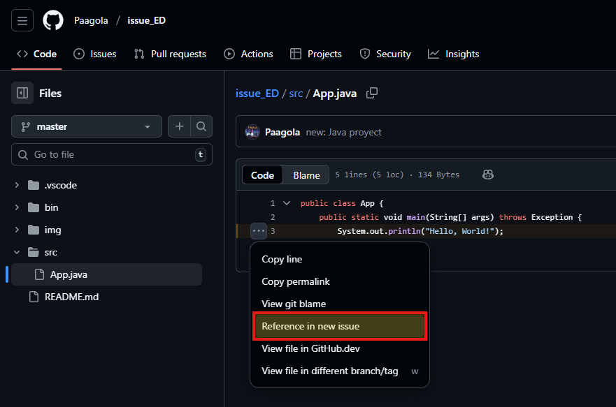
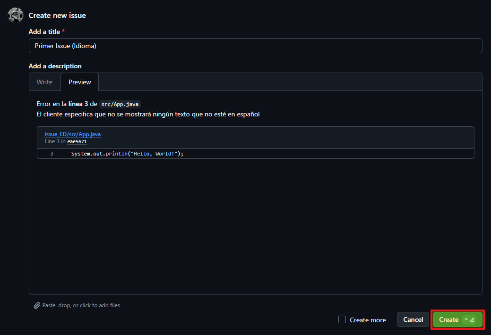
</div>

<div align="center">

</div>

#### **Issue #2: Segundo Issue (Manejo de excepciones)** 📚
- **Título:** "Segundo Issue (Manejo de excepciones)"
- **Descripción:** 
  - Error de manejo de excepciones en línea 2
  - "Error de manejo de excepciones, te dejo la documentación para arreglarlo: documentación.txt"
- **Etiqueta:** `documentation`
- **Referencia:** Línea 2 del código

<div align="center">
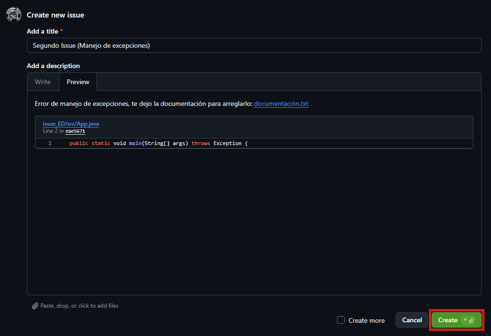
</div>

<div align="center">
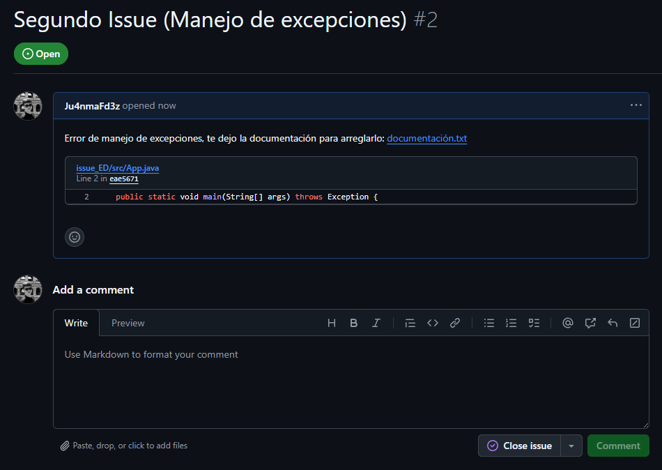
</div>

---

### 2️⃣ Etiquetado de Issues

Los issues fueron etiquetados utilizando las etiquetas predeterminadas de GitHub:

<div align="center">
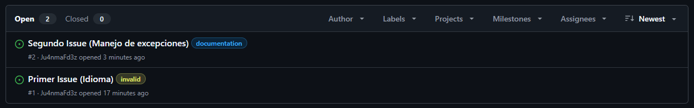
</div>

| Etiqueta | Color | Descripción |
|----------|-------|-------------|
| `invalid` | 🟡 | Este problema no parece correcto |
| `documentation` | 🔵 | Mejoras o adiciones a la documentación |

**Vista de etiquetación de issues con etiquetas:**

<div align="center">
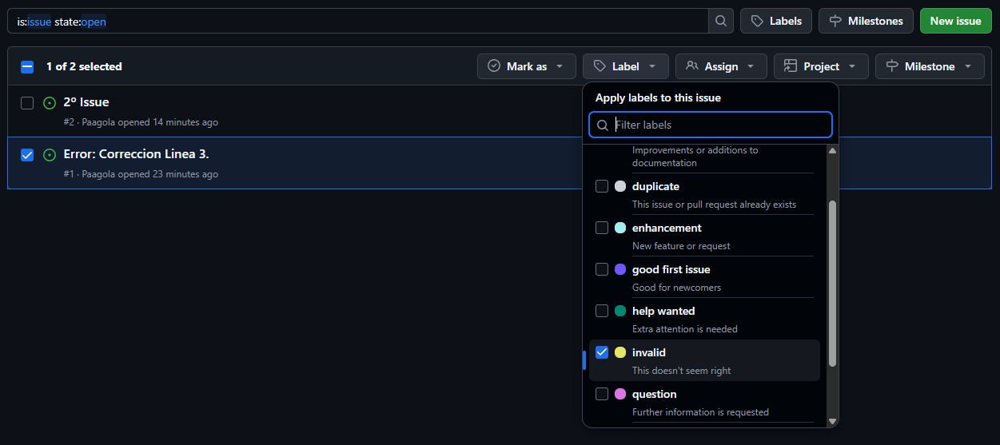
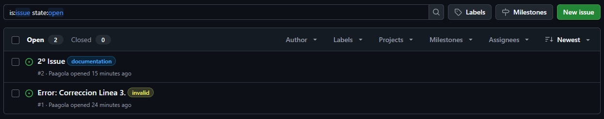
</div>

---

### 3️⃣ Cierre de Issues desde Terminal

Los issues se cerraron mediante commits desde la línea de comandos usando la sintaxis especial de GitHub:

```bash
# Listar issues abiertos
gh issue list

# Cerrar issue #1 con comentario
gh issue close 1 -c "Solucionado"

# Cerrar issue #2 con comentario
gh issue close 2 -c "Solucionado"
```

<div align="center">
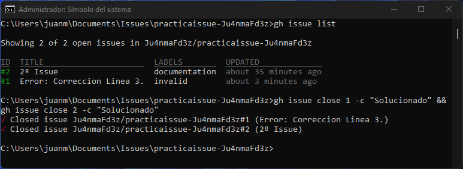
</div>

#### Salida del comando `gh issue list`:

```
Showing 2 of 2 open issues in Ju4nmaFd3z/practicaissue-Ju4nmaFd3z

ID  TITLE                              LABELS          UPDATED
#2  2º Issue                           documentation   about 35 minutes ago
#1  Error: Correccion Linea 3.         invalid         about 3 minutes ago
```

#### Comandos de cierre ejecutados:

```bash
gh issue close 1 -c "Solucionado" && gh issue close 2 -c "Solucionado"
```

**Resultado:**
```
✓ Closed issue Ju4nmaFd3z/practicaissue-Ju4nmaFd3z#1 (Error: Correccion Linea 3.)
✓ Closed issue Ju4nmaFd3z/practicaissue-Ju4nmaFd3z#2 (2º Issue)
```

---

## 📸 Galería de Capturas

### Estado Final de Issues

<div align="center">

**Issues Cerrados**

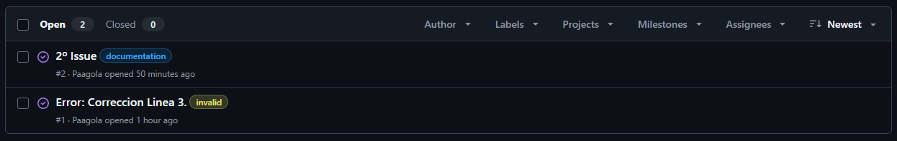
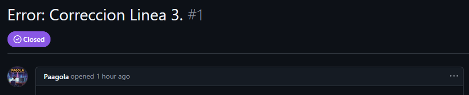
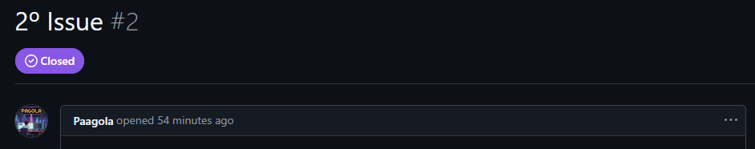

</div>

---

## 🛠️ Tecnologías Utilizadas

- **Java** - Lenguaje de programación
- **Git** - Control de versiones
- **GitHub Issues** - Sistema de seguimiento de problemas
- **GitHub CLI** (`gh`) - Herramienta de línea de comandos

---

## 📚 Conceptos Aprendidos

1. **Referenciación de código**: Cómo crear issues que apuntan a líneas específicas del código usando "Reference in new issue"
2. **Etiquetado**: Uso de labels para categorizar y priorizar issues
3. **Cierre automatizado**: Cerrar issues mediante keywords en commits (`Close #N`, `Fixes #N`, `Resolves #N`)
4. **GitHub CLI**: Uso de `gh` para gestionar issues desde terminal
5. **Trabajo colaborativo**: Flujo de trabajo en equipo usando GitHub

---

## 📌 Keywords de GitHub para Issues

GitHub reconoce automáticamente estas palabras clave en commits:

| Keyword | Descripción |
|---------|-------------|
| `close #N` | Cierra el issue #N |
| `closes #N` | Cierra el issue #N |
| `closed #N` | Cierra el issue #N |
| `fix #N` | Cierra el issue #N |
| `fixes #N` | Cierra el issue #N |
| `fixed #N` | Cierra el issue #N |
| `resolve #N` | Cierra el issue #N |
| `resolves #N` | Cierra el issue #N |
| `resolved #N` | Cierra el issue #N |

**Ejemplo de uso:**
```bash
git commit -m "Corregido texto en español" -m "Fixes #1"
git commit -m "Añadida documentación de excepciones" -m "Closes #2"
```

---

## 🎓 Conclusiones

Esta práctica nos ha permitido:

- ✨ Comprender el flujo de trabajo con issues en GitHub
- 🤝 Practicar la colaboración en equipo mediante issues
- 🔧 Dominar el cierre de issues mediante GitHub CLI
- 📊 Organizar tareas mediante etiquetas
- 💡 Integrar GitHub CLI en nuestro flujo de trabajo
- 🎯 Referenciar código específico en issues para mejor trazabilidad

### Ventajas del uso de Issues:

1. **Trazabilidad**: Cada problema queda documentado
2. **Colaboración**: Facilita la comunicación entre desarrolladores
3. **Organización**: Las etiquetas permiten categorizar problemas
4. **Automatización**: Cierre automático mediante commits
5. **Historia**: Registro completo de cambios y decisiones

---

<div align="center">

**⭐ Si te ha gustado esta práctica, dale una estrella al repositorio ⭐**

Hecho por Juanma Fernández & Víctor Pagola

---

</div>